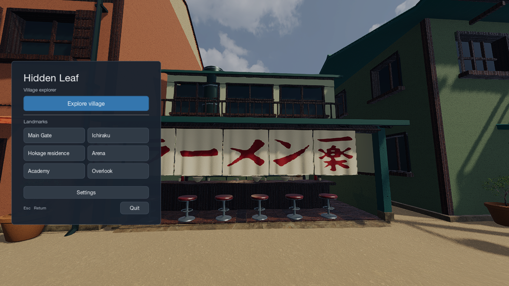
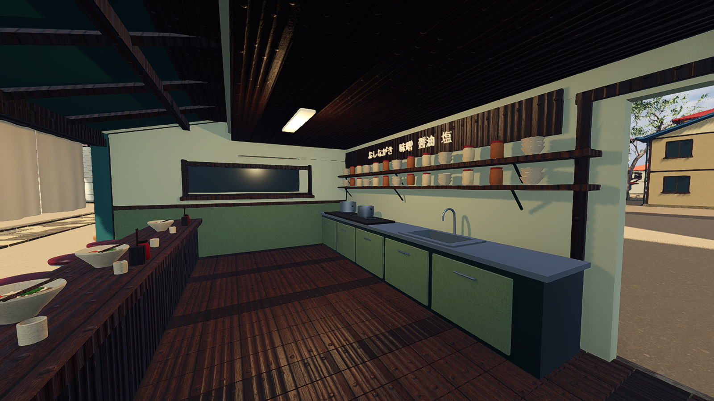

# Hidden Leaf

**Development branch:** the five-village expansion is unfinished and has not passed release acceptance. The default scene and linked release remain the existing Hidden Leaf experience. See [reconstruction status](evidence/review.md).

An explorable Hidden Leaf Village scene built with Godot and Blender. Walk through the village, enter Ichiraku, or jump between six landmarks.

[Download for Apple Silicon Mac](https://github.com/dicnunz/hidden-leaf/releases/tag/v0.3.0)



[Browse native screenshots and controls](https://dicnunz.github.io/demos/hidden-leaf/)

## Run

The Mac download includes the engine and assets and runs offline. It is ad hoc signed, without Apple notarization.

To run from source, install **Godot 4.7.1** and **Python 3.11+**, then:

```sh
python3 tools/fetch_assets.py
godot --headless --editor --path . --import
godot --path .
```

The asset download contains the generated scene, vegetation and material maps. Its SHA-256 is pinned in [`assets.lock.json`](assets.lock.json). Large assets are distributed with releases so the Git history stays small.

**WASD / arrows** move · **Mouse** looks · **Shift** runs · **Space** jumps · **Esc** pauses.

The menu includes landmark shortcuts, fullscreen, mouse sensitivity and three graphics settings. The build has been tested on an Apple M3 using Metal and Forward+ rendering.

The menu groups landmarks in two columns. Settings open on demand; graphics, fullscreen and look sensitivity are saved locally.

## Implementation

- [`scripts/player.gd`](scripts/player.gd): capsule collision, step handling and a camera updated independently of the physics tick.
- [`scripts/main.gd`](scripts/main.gd): scene loading, material setup, collision construction and five vegetation mesh detail levels.
- [`tools/model/`](tools/model/): Blender/Python generation of buildings, terrain and landmarks. The shop's curtains, roof, window recesses and kitchen are geometry.
- [`qa/`](qa/): controller checks, world collision routes and rendered walking benchmarks.

The geometry generator and Mac packager are included under [`tools/`](tools/). See [building and checks](docs/development.md) for their requirements and commands.

## Scope

The existing Leaf reconstruction uses the pre-Pain Shippuden era. Its village layout and Hokage likenesses are approximate. Most buildings have exterior geometry only; Ichiraku has an accessible interior. There are no characters or gameplay objectives.



## License

Original code is [MIT licensed](LICENSE). Naruto names, characters and designs belong to their respective rights holders. Third-party vegetation, textures and sky retain their CC0 terms. [Credits and reference sources](CREDITS.md).
