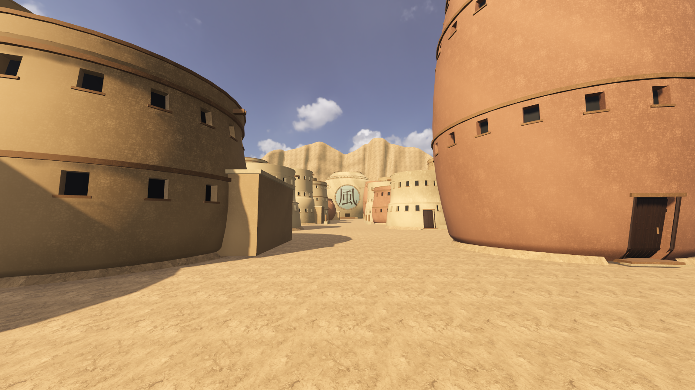

# Release review

**Not approved.** The requested five-village application is incomplete. The existing default scene, release and public demo have not been replaced.

The current branch contains a generated Sand environment and a separate application that loads prepared Leaf and Sand scenes. Mist, Cloud and Stone have evidence records but no environments. The village selector does not imply those worlds exist: missing scenes produce a recoverable error.

## Blocking findings

- Sand has repeated building arrangements, insufficient street detail and weak canyon geology. Its visible surfaces and terrain transitions do not meet the required physical realism.
- The office silhouette was corrected against an inspected reference image, but that secondary reproduction's original episode remains unidentified. Its inferred metric dimensions and connective layout are not canonically exact.
- Leaf's prepared scene still fails the sustained gate-route target. Subsequent measured interventions did not resolve it.
- Three villages, environmental audio, all-five sustained traversal, final art/engineering acceptance, a reproducible final package and a trailer captured from approved shipping environments remain outstanding.

The evidence classifications in this directory record confidence in individual claims. They do not certify the generated world as accurate or finished.

## Measured baseline

Apple M3 MacBook Air, 16 GB, Godot 4.7.1, Metal/Forward+, 1600×900 window with the original 0.8 internal render scale. Each route was measured for 60 seconds after 10 seconds of warmup, with the actual controller walking repeatedly through a 28 m corridor.

| Original Leaf route | Mean | p95 | p99 |
| --- | ---: | ---: | ---: |
| Gate | 40.57 ms | 50.41 ms | 56.51 ms |
| Market | 38.28 ms | 50.86 ms | 58.85 ms |
| Residence | 24.57 ms | 34.94 ms | 40.49 ms |

The original controller and world suites passed 39 and 35 checks. Sand's generated-geometry and traversal checks passed 10 checks. The isolated scene-switching fixture passed its valid, busy and missing-resource cases. These are limited checks, not release acceptance.

The prepared Leaf scene was subsequently measured at **native 1600×900**, with TAA, authored UVs, the twig-card foliage and GPU-compressed texture imports. The same three corridors ran for 60 seconds each after 10 seconds of warmup:

| Prepared Leaf route | Mean | p95 | p99 |
| --- | ---: | ---: | ---: |
| Gate | 22.24 ms | 23.21 ms | 24.32 ms |
| Market | 14.26 ms | 15.65 ms | 17.04 ms |
| Residence | 7.22 ms | 7.95 ms | 20.16 ms |

Every corridor completed nine reversals without a sustained movement block. No measured frame exceeded 50 ms. Process RSS sampled after warmup ranged from 922 MB to 934 MB across the three routes, with no within-route growth evident in those samples. This short run does not establish long-term thermal or memory stability. Loading to the first rendered frame took **16.32 seconds**, including first-use rendering preparation. The gate route fails the 16.7 ms mean target; the expansion remains unapproved.

The native diagnostics are measurements of these particular views and settings. The old baseline used a smaller internal resolution, so these are not a controlled single-variable optimization comparison.

A subsequent short **Leaf → Sand → Leaf** run kept exactly one world node resident at every transition. With the renderer cache warm, scene requests reached their first drawn frame in 1.18 s, 0.55 s and 0.80 s respectively. Every tested corridor completed two reversals without a sustained movement block. The run deliberately reports a failed sustained gate because its 15-second measurements and 2-second warmups are diagnostic only. It does not establish all-five switching or long-term memory stability.

## Implemented engineering

Scene construction runs during asset preparation. Saved runtime scenes retain external textures and are loaded through one persistent session controller. Leaf and Sand serialization checks verify exact mesh, MultiMesh and collision counts after reload. A discovered imported-scene duplication defect was fixed before accepting those files.

The foliage preparation recovers 2,437 twig transforms from the original CC0 source and represents each twig with three intersecting alpha-tested planes. Near-tier geometry drops from 257,998 to 42,620 triangles; original distant and horizon tiers remain because the new representation costs more at those distances. Matched runtime views retain canopy coverage, with approximate leaf-level parallax. This is not a sustained performance result.

Static-lighting experiments use Godot's actual editor baker and reload its generated lightmap data. Village-scale visual and performance results must be reviewed separately from the successful two-box mechanism test.

The Sand bake was rejected after actual render review: facade seams and missing ground are visible. GPU-compressed material imports also improved the unbaked scene, so that performance change cannot be attributed solely to baked lighting. Short stationary diagnostics do not establish sustained traversal performance.

The missing-ground defect was isolated to occlusion culling. The prepared unbaked Sand scene now excludes its inexpensive, village-wide ground mesh from that culling; its buildings retain occlusion. Rendered traversal verified the ground remains present. The baked facade seams remain unresolved, and the lit scene is not selected by the application.



## Reproduce the development scenes

Fetch the original pinned release assets as described in the README. Then use Blender 5.2 and Godot 4.7.1:

```sh
python3 tools/fetch_surface_assets.py
blender --background --python tools/model/prepare_leaf.py
blender --background --python tools/model/prepare_foliage.py -- --source /path/to/tree_small_02.blend
blender --background --python tools/model/build_villages.py -- --village sand --slice
godot --headless --editor --path . --import
godot --headless --path . --script tools/configure_texture_imports.gd
godot --headless --editor --path . --import
godot --headless --path . --script tools/bake_runtime.gd -- --village=leaf
godot --headless --path . --script tools/bake_runtime.gd -- --village=sand
godot --path . res://exploration.tscn
```

The original CC0 tree Blender file and its texture folder are available from [Poly Haven](https://polyhaven.com/a/tree_small_02). This run used source SHA-256 `af3fef6da3eb97057d9d4d3c4281c5944696b8d518715deddd8500482d30b1bd`. Japanese lettering requires the existing `HIDDEN_LEAF_FONT` override or a supported macOS font. Generated metadata records the actual font and hash. A clean independent regeneration of the complete expanded application has not passed.

Actual loaded-world measurement:

```sh
godot --path . --resolution 1600x900 --script qa/sustained_exploration.gd -- --qa --qa-out="$PWD/.build/exploration-qa" --villages=leaf,sand,leaf
```

Raw measurements and captured views are written under `.build/`. Short diagnostic runs are explicitly ineligible for sustained acceptance.

## Active feasibility intervention

The follow-up intervention changed implementation and measured each candidate. Both approval gates remain unmet. The Leaf source experiments were removed after measurement; source and prepared geometry retain the previous tree placements, LODs, shadows and quality settings.

Fresh stationary diagnostics used the actual application at native 1600×900, its gate camera at (0, 0.24, 380), three seconds of warmup and 240 measured frames. These comparisons identify intervention effects; they are not sustained acceptance.

| Leaf candidate | Mean | p95 | Draw calls | Primitives | Disposition |
| --- | ---: | ---: | ---: | ---: | --- |
| Control, 24 m tree cells | 22.43 ms | 23.58 ms | 4,355 | 8.89 M | Gate fails |
| 64 m tree cells | 24.15 ms | 25.24 ms | 3,004 | 11.98 M | Removed; coarse LOD selection promotes excess geometry |
| 64 m cells with per-tree runtime LOD selection | 24.00 ms | 24.08 ms | 5,548 | 11.96 M | Removed; mixed LOD batches and larger culling bounds remain expensive |
| Canopy alpha depth prepass | 22.34 ms | 23.29 ms | 4,358 | 8.89 M | Removed; no material benefit |

Diagnostic isolation measured 12.31 ms with the forest hidden, 20.66 ms with shadows disabled, and 19.79 ms with SSAO disabled. Those controls were restored and are not proposed shipping settings.

Sand received two generated and rendered passes. The first narrowed and staggered residential frontages, varied height, added attached rooms and varied weathering. It exposed a blocked old Clay bookmark and retained striped cliff faces. The second reserved a connected 3 m residential lane centered at x = -19 m, moved that bookmark into the lane, added doorway-separated sand accumulation skirts, welded the cliff into a continuous surface and removed its rigid material bands. Office geometry and metric entrances were retained. Lane tests follow the revised physical street.

The latest screenshot above is from the rebuilt runtime. Street enclosure and continuity improved, but repeated facade details, pebbled plaster, elementary geological form and insufficient environmental detail still fail the professional visual gate. No strategy is approved for scaling to the remaining villages. Raw comparison logs and images are under `.build/intervention/`.

The updated Sand geometry/controller suite passed 10/10 checks. A subsequent native 1600×900 run measured each route for 60 seconds after 10 seconds of warmup:

| Sand route | Mean | p95 | p99 |
| --- | ---: | ---: | ---: |
| Sand avenue | 5.78 ms | 5.92 ms | 8.04 ms |
| Kazekage approach | 5.33 ms | 6.16 ms | 7.35 ms |
| Clay district | 5.76 ms | 6.29 ms | 17.08 ms |

Each route completed eight reversals with no sustained movement block, no loss of ground contact and no frame above 50 ms. This passes the implemented three-route performance test, not long-term thermal acceptance or the visual gate. The harness now waits for initial Leaf startup before requesting a different first village.

An additional Vulkan/Forward+ comparison retained the same scene and rendering settings. It measured 24.04 ms mean and 24.14 ms p95, slower than the Metal control, and emitted MoltenVK pipeline-cache write errors. The application retains Metal. Four measured Leaf strategies and two rendered Sand passes therefore leave the joint feasibility gate unapproved.
